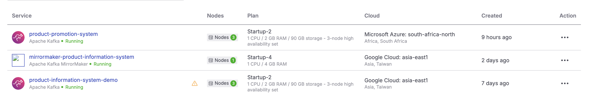
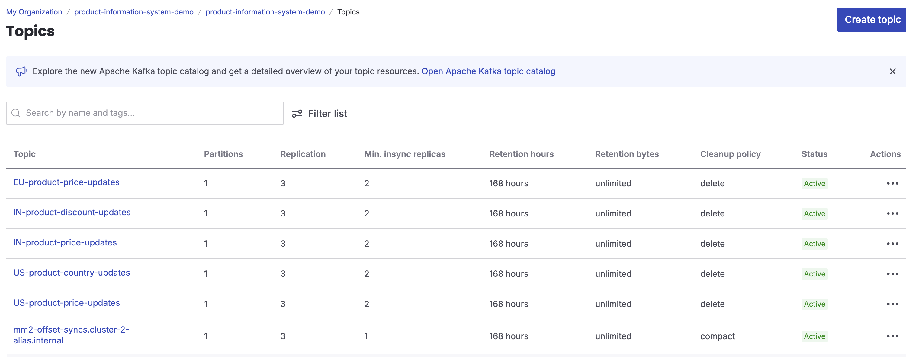
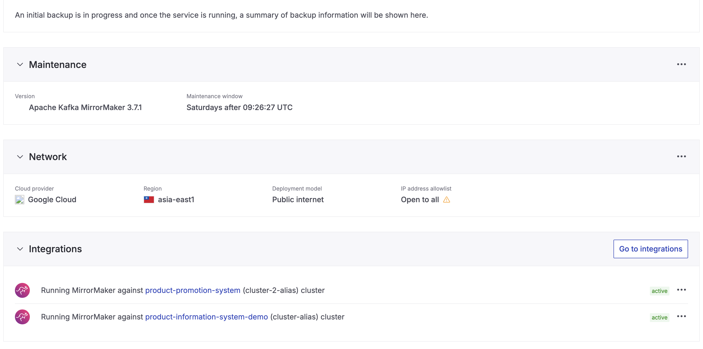
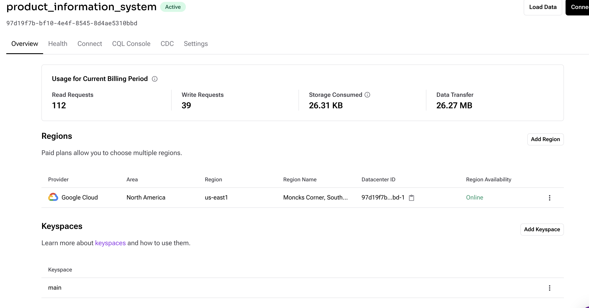

# event-based-message-exchange-infrastructure

It is always better to configure Infrastructure as Code.
For this assignment, most of the infra has been configured manually, eg:  Setting up cassandra in datastax, or the whole kafka ecosystem in aiven cloud. 

Aiven comes with aiven-cli which can be clubbed with code configuration management tools like ansible etc. 
Here since I had configured aiven manually, I have tried to just write a shell script (untested) to simulate/show what all services/configs/integrations were created using avn cli. 
The idea is, in an actual prod code, all of this should be configured using better tools (and not shell script) and tested and configured. 

The current file `configure-aiven.sh` just helps in basic understanding as of now.

Similarly we should this repo (or a modularized version if needed) for creation of cassandra on cloud as well. It gives better configurability. 

Here is the view, how they will be created: 

We also should take care of the other infrastructure, like where to host our frontend and backend services. 

